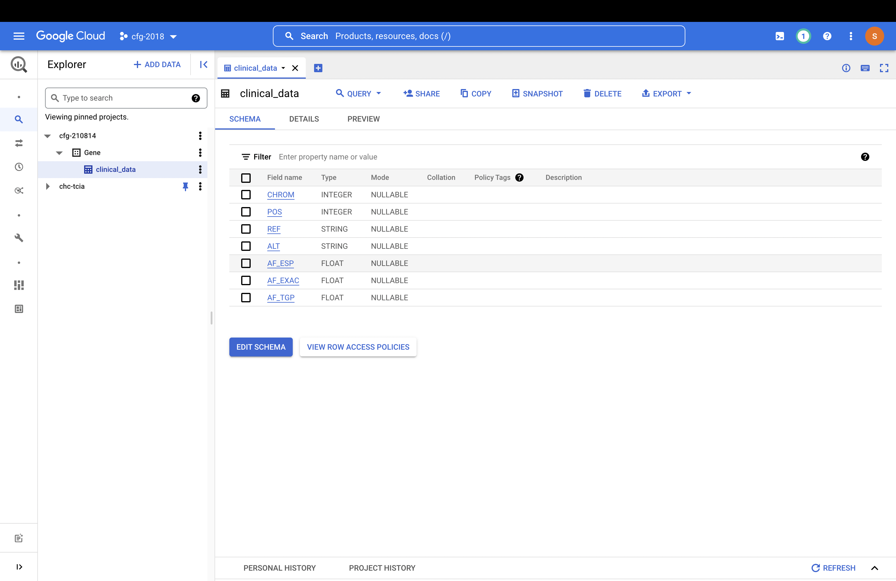

# embeding_data_studio

### Steps followed
- Uploaded [sample data](./sample_data.csv) in bigquery with project_name as `cfg-210814`, dataset_name as `Gene` and table_name as `clinical_data`.

- Connected data studio with the created bigquery table.

- The generated chart is then embedded into the website. Deployed URL is [embeding_data_studio](https://embedding-data-studio.netlify.app/).
The website displays scattered plot for each chrom type. The X-axis represents each `CHROM` type and Y-axis represents `AF_EXAC`. The chart additionally includes a drop-down filter to either include or exclude the specific `CHROM` from the scatter plot.